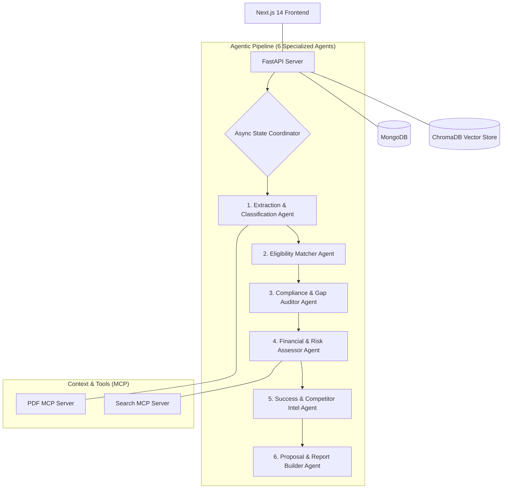

# TenderAI — AI-Powered Tender Intelligence Platform

TenderAI is an AI-powered B2B government tender discovery and intelligence platform. It automates the process of analyzing government bids, scoring vendor eligibility, auditing compliance gaps, estimating project costs, and drafting formal proposal responses.

---

## 🚀 Key Features
* **Smart Tender Discovery:** Automatically scrapes, parses, and centralizes active government tenders from portals like GeM, CPPP, and RBI.
* **Symmetric 2x3 Agent Pipeline:** Orchestrates 6 specialized AI agents running sequentially and in parallel to analyze documents, evaluate compliance, match MSME subsidies, and estimate costs.
* **Retrieval-Augmented Generation (RAG):** Integrates local vector search using **ChromaDB** to match your profile against 20+ government subsidies and provide factual chat responses.
* **Dynamic PDF Export:** Dynamic multi-page PDF generation compiling all analysis metrics, charts, and proposal drafts.
* **Zero-Lag Interface:** Optimized frontend state caching and list pagination for 100% lag-free state tab switching.

---

## 📐 System Architecture

The platform follows a decoupled client-server architecture. The Next.js 14 frontend communicates with the FastAPI backend over REST APIs for resource operations and WebSockets for real-time agent status tracking. The backend orchestrates a 6-agent sequential pipeline using LangGraph, storing structured results in MongoDB and matching government subsidies using semantic vector search in ChromaDB. File extraction and search capabilities are extended using specialized Model Context Protocol (MCP) server tools.



---

## 🤖 The 6 Specialized AI Agents

1. **Extraction & Classification Agent:** Utilizes **Gemini 2.5 Flash** visual processing to extract eligibility parameters, deadlines, and requirements from tender PDFs.
2. **Eligibility Matcher Agent:** Scores the vendor business profile against extracted tender criteria (experience, certifications, turnover).
3. **Compliance & Gap Auditor Agent:** Identifies missing quality certifications or technical stack gaps and suggests mitigations.
4. **Financial & Risk Assessor Agent:** Computes hosting, operational, and team costs, audits delivery risks, and matches central/state MSME subsidies.
5. **Success & Competitor Intel Agent:** Evaluates historical data to predict competitor density and calculates win probability.
6. **Proposal & Report Builder Agent:** Generates proposal drafts (via **Groq Llama 3.3 70B**) and compiles the final 15-page PDF report.

---

## 🛠️ Tech Stack

* **Frontend:** Next.js 14 (App Router), React, Tailwind CSS, Framer Motion
* **Backend:** FastAPI, Uvicorn, Python
* **Database:** MongoDB (Motor Async Client)
* **Vector Store (RAG):** ChromaDB (using `all-MiniLM-L6-v2` embeddings)
* **LLMs:** Groq (Llama 3.3 70B), Google Gemini (2.5 Flash)
* **PDF Compile:** ReportLab

---

## ⚙️ Quick Start Guide

### Manual Setup

#### 1. Backend Setup
```bash
cd backend
python -m venv .venv
source .venv/bin/activate  # On Windows: .venv\Scripts\activate
pip install -r requirements.txt
python -m uvicorn main:app --host 127.0.0.1 --port 8000 --reload
```

#### 2. Frontend Setup
```bash
cd frontend
npm install
npm run dev
```

Open [http://localhost:3000](http://localhost:3000) to view the application.
